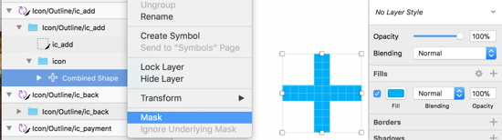
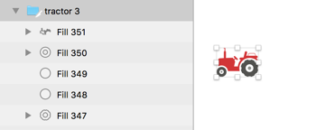
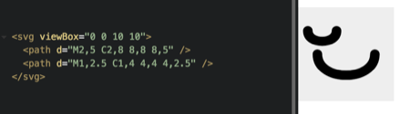

# How to render svg files with react native ART?

We are not going to use any svg library, instead we will take advantage of [react native ART](https://github.com/react-native-china/react-native-ART-doc/blob/master/doc.md) library.

The interface looks like this.  

```javascript
import {ART} from 'react-native';
const {
  Surface,
  Shape,
  Group,
  Text,
  Path,
  ClippingRectangle,
  LinearGradient,
  RadialGradient,
  Pattern,
  Transform
} = React.ART
```

Let's start with simple svg, a plus icon like (
).  
I've exported it from skatch app by right-clicking on the container and choosing "Copy SVG Code".


Unfortunately the generated code is far from perfect, we have a long way to go before we can implement it in react native.  
Let's make some adjustments ...
```html
<svg width="10px" height="10px" viewBox="0 0 10 10" version="1.1" xmlns="http://www.w3.org/2000/svg" xmlns:xlink="http://www.w3.org/1999/xlink">
    <!-- Generator: Sketch 49.3 (51167) - http://www.bohemiancoding.com/sketch -->
    <desc>Created with Sketch.</desc>
    <defs>
        <path d="M4,6 L6.08689958e-15,6 L5.37635684e-15,4 L4,4 L4,3.6e-15 L6,3.6e-15 L6,4 L10,4 L10,6 L6,6 L6,10 L4,10 L4,6 Z" id="path-1"></path>
    </defs>
    <g id="Icon" stroke="none" stroke-width="1" fill="none" fill-rule="evenodd">
        <g id="Icon/Outline/ic_add" transform="translate(-15.000000, -15.000000)">
            <g id="icon">
                <g transform="translate(20.000000, 20.000000) rotate(-270.000000) translate(-20.000000, -20.000000) translate(15.000000, 15.000000)">
                    <mask id="mask-2" fill="white">
                        <use xlink:href="#path-1"></use>
                    </mask>
                    <g id="Combined-Shape" fill-rule="nonzero"></g>
                    <g id="↪-Color" mask="url(#mask-2)">
                        <g transform="translate(-19.000000, -19.000000)" id="Color/Blue">
                            <g>
                                <rect id="↳-🎨-Color" fill="#00A0E1" x="-1.42e-14" y="3.2e-14" width="48" height="48"></rect>
                            </g>
                        </g>
                    </g>
                </g>
            </g>
        </g>
    </g>
</svg>
```

Looking at the svg content, we don't really need the `mast`.  


In the sketch file, The + sign is masked on top of a colored background.
Let's fix that, untick the `Mask` option, remove the background color and choose the fill color for the combined shape.



Now we have a clean shape.  
If we export it again we get this.
```html
<svg width="10px" height="10px" viewBox="0 0 10 10" version="1.1" xmlns="http://www.w3.org/2000/svg" xmlns:xlink="http://www.w3.org/1999/xlink">
    <!-- Generator: Sketch 49.3 (51167) - http://www.bohemiancoding.com/sketch -->
    <desc>Created with Sketch.</desc>
    <defs></defs>
    <g id="Icon" stroke="none" stroke-width="1" fill="none" fill-rule="evenodd">
        <g id="Icon/Outline/ic_add" transform="translate(-15.000000, -15.000000)" fill="#00AFF8" fill-rule="nonzero">
            <g id="icon">
                <g transform="translate(20.000000, 20.000000) rotate(-270.000000) translate(-20.000000, -20.000000) translate(15.000000, 15.000000)">
                    <path d="M4,6 L6.08689958e-15,6 L5.37635684e-15,4 L4,4 L4,3.6e-15 L6,3.6e-15 L6,4 L10,4 L10,6 L6,6 L6,10 L4,10 L4,6 Z" id="Combined-Shape"></path>
                </g>
            </g>
        </g>
    </g>
</svg>
```

Much better, no sign of `mask` anymore. Now let's get rid of those `transform` attribute, they are useless because because the portent `g` element is doing the opposite transform. We can fix this or similar issues (useless `g` elements) by hand, but we don't need to!  

We will use [SVGO](https://github.com/svg/svgo) library instead, a really nice command line tool to optimize svg files.

```bash
$ npm install -g svgo
$ svgo -i source.svg -o optimized.svg
```

SVGO does a lot of optimizations (unfortunately not the mask optimization, that's why we needed to remove the mask manually).  

After running `svgo -i plus.svg -o plus_o.svg` with `plus.svg` being the exported svg file, we get the following output.

```html
<svg width="10" height="10" xmlns="http://www.w3.org/2000/svg">
  <path d="M4 4V0h2v4h4v2H6v4H4V6H0V4h4z" fill="#00AFF8" fill-rule="nonzero"/>
</svg>
```
All those useless `translate` and `transforms` are gone, all those extra `g` elements are removed, the `d` attribute has been shortened, now we can actually start porting this to a react native component.


Turns out RN ART library has a `<Shape />` component that is roughly equal to `<path />` element in svg, so our first attempt will be an almost one to one mapping to react native code.

```javascript
class PlusIcon extends React.Component {
  render() {
    const d = "M4 4V0h2v4h4v2H6v4H4V6H0V4h4z";
    const {fill = 'red'} = this.props;

  	return (
  		<Surface width={10} height={10}>
  			<Shape fill={fill} d={d} />
  		</Surface>
  	);
  }
}
// example use: <PlusIcon fill="red" />
```

Instead of `<svg width="10" height="10" />` we are using `<Surface />` component and instead of `<path d="..." />` we are using `<Shape />`.  

But wait a minute, `width` & `height` are fixed here, It is not **scalable** (svg stands for scalable vector graphics after all)!  

How can we fix that? Let's take a closer look at the `d` attribute.

- It iss drawing in a `10 x 10` grid (the svg width & height).
- `M4 4` move to location (x,y) = (4,4)
- `V0` draw a vertical line with length 0
- `h2` draw a horizontal line from where you are with length 2
- `v4` draw a vertical line from where you are with length 4
- ...
- `z` close the path

Please take a moment and think about what will happen to these numbers if when scale the svg file `2X` (e.g to be `20 x 20` instead of `10 x 10`)?

I have actually done it manually in sketch and exported it, here is the output for both sizes.

- d for 10 x 10 = `M4 4V0h2v4h4v2H6v4H4V6H0V4h4z`
- d for 20 x 20 = `M8 8V0h4v8h8v4H12v8H8V12H0V8h8z`

As you might have already guessed all numbers are multiplied by a factor of `2`.  

We will take advantage of this fact to fix our `PlusIcon` component.

```javascript
class PlusIcon extends React.Component {
  render() {
    const path = "M4 4V0h2v4h4v2H6v4H4V6H0V4h4z";
    const {fill = 'red', size = 10} = this.props;

      //regex to parse the path
  	const segment = /([astvzqmhlc])([^astvzqmhlc]*)/ig;
  	const number = /-?[0-9]*\.?[0-9]+(?:e[-+]?\d+)?/ig;

  	const d = path.replace(segment, (_, cmd, args) => {
  		let numbers = args.match(number) || [];
  		return cmd + numbers.map(n => n * size/10).join(' ');
  	});

  	return (
  		<Surface width={size} height={size}>
  			<Shape fill={fill} d={d} />
  		</Surface>
  	);
  }
}
// example use: <PlusIcon fill="red" size={200} />
```

We have a some regular expressions to parse the `path` attribute, `segment` is used to split commands to [`M4 4`, `V0`, ... , `z`] and `number` is used to split the numbers in each command.  

We know the original size is `10`, so we just scale each number by `size/10` (`numbers.map(n => n * size/10).join(' ')`).  

So far so good, now let's try a complicated icon, say a tractor!



This icon is not masked, we don't need to worry about `mask` this time.
However this icon is much more complicated, we have multiple `path` elements with much more complicated `d` attributes.

After optimizing the sketch output wiht SVGO we get the following result.

```html
<svg width="97" height="68" xmlns="http://www.w3.org/2000/svg">
    <g fill="none" fill-rule="evenodd">
        <path d="M76.347 ... z" fill="#52524F"/>
        <path d="..." fill="#8E908C"/>
        <path d="..." fill="#52524F"/>
        <path d="..." fill="#D23537"/>
    </g>
</svg>
```

We can ignore the `g` element, It doesn't make any visual difference.  
But two things are different this time.  

 1. first we have multiple path elements
 2. width != height

Our desired interface would be a general purpose component that can render number of `d` attributes not just one, we will name it `<IconBuilder />` and here is how it will be used.

```javascript
class TractorIcon extends React.Component {
  render() {
    return (
      <IconBuilder
        width={97}
        height={68}
        paths={[
          {fill: "#52524F", d:"..."},
          {fill:"#8E908C", d:"..." },
          {fill:"#52524F", d:"..."},
          {fill:"#D23537", d:"..." }
        ]}
      />
    );
  }
}
```


If we ignore the scaling a trivial implementation for `IconBuilder` would be.

```javascript
class IconBuilder extends React.Component {
  renderPath(path, fill, key, scale = 1) {
    const segment = /([astvzqmhlc])([^astvzqmhlc]*)/ig;
    const number = /-?[0-9]*\.?[0-9]+(?:e[-+]?\d+)?/ig;

    const d = path.replace(segment, (_, cmd, args) => {
      let numbers = args.match(number) || [];
      return cmd + numbers.map(n => n * scale).join(' ');
    });
    return (<Shape key={key} fill={fill} d={d} />);
  }
  render() {
    const {paths, width, height} = this.props;

    return(
      <Surface width={width} height={height}>
        {paths.map(
          (path, idx) => this.renderPath(path.d, path.fill, idx)
        )}
      </Surface>
    );
  }
}
```


Now let's consider the second issue, we want the **s**vg to be **scalable** on both directions this time, x & y. If we look at svg documentation we can see a pattern.  

For the full description please see [css-tricks article](https://css-tricks.com/svg-path-syntax-illustrated-guide/), i copied the descriptions above from that article for simplicity.

- **Movement Commands**

  - `M x,y`	Move to the absolute coordinates x,y
  - `m x,y`	Same as `M` but relative
  - `L x,y`	Draw a straight line to the absolute coordinates x,y
  - `l x,y`	Same as `L` but relative
  - `H x`	Draw a line horizontally to the exact coordinate x
  - `h x`	Same as `H` but relative
  - `V y`	Draw a line vertically to the exact coordinate y
  - `v y`	Same as `V` but relative
  - `Z` (or z )	Draw a straight line back to the start of the path

- **Arc Commands**
  - `C cX1,cY1 cX2,cY2 eX,eY`	Draw a bezier curve ...
  - `S cX2,cY2 eX,eY`	Same a C command ...
  - `Q cX,cY eX,eY`	Draw a bezier curve ...
  - `T eX,eY` Basically a Q command ...
  - `A rX,rY rotation, arc, sweep, eX,eY`	Draw an arc that is based on the curve an oval makes. First define the width and height of the oval. Then the rotation of the oval. Along with the end point, this makes two possible ovals. So the arc and sweep are either 0 or 1 and determine which oval and which path it will take.
  - `t` Same with all relative values
  - `q` Same with all relative values
  - `c` Same with all relative values
  - `s` Same with all relative values
  - `a` Same with relative values for eX,eY

It's clear that X,Y values will be scaled relative `x` & `y`(width and height) respectively.  
Here is an example to prove this point. As you can see, even for more complicated commands  such as bezier arcs, scaling relative to `x` & `y` direction works.



What about the `A` command you might ask?  
The answer is to keep rotation, arc & sweep parameters and scale the rest.


```javascript
class IconBuilder extends React.Component {
  scaleCommand(cmd, numbers, scaleX, scaleY) {
    if(/(M|L|H|V|Z|C|S|Q|T)/i.test(cmd)) {
      for(let idx = 0; idx < numbers.length; ++idx) {
        numbers[idx] *= idx%2 ? scaleX : scaleY;
      }
    }
    if(/A/i.test(cmd)) {
      for(let idx = 0; idx < numbers.length; ++idx) {
        if(idx%7 === 0 || idx%7 === 5) {
          numbers[idx] *= scaleY;
        }
        if(idx%7 === 1 || idx%7 === 6) {
          numbers[idx] *= scaleX;
        }
      }
    }
    return cmd + numbers.join(' ');
  }
  renderPath(path, fill, key, scaleX, scaleY) {
    const segment = /([astvzqmhlc])([^astvzqmhlc]*)/ig;
    const number = /-?[0-9]*\.?[0-9]+(?:e[-+]?\d+)?/ig;

    const d = path.replace(segment, (_, cmd, args) => {
      let numbers = args.match(number) || [];
      return this.scaleCommand(cmd, numbers, scaleX, scaleY);
    });
    return (<Shape key={key} fill={fill} d={d} />);
  }
  render() {
    const {paths, orgWidth, orgHeight} = this.props;
    const {width = orgWidth, height = orgHeight} = this.props;

    const scaleY = width/orgWidth,
          scaleX = height/orgHeight;
    return(
      <Surface width={width} height={height}>
        {paths.map((path, idx) =>
          this.renderPath(path.d, path.fill, idx, scaleX, scaleY)
        )}
      </Surface>
    );
  }
}
```

And our `<IconBuilder />` will be used like this.

```javascript
class TractorIcon extends React.Component {
  render() {
    const orgWidth = 97, orgHeight = 68;
    const {width = orgWidth, height = orgHeight} = this.props;
    return (
      <IconBuilder
        orgWidth={97}
        orgHeight={68}
        width={width}
        height={height}
        paths={[
          {fill: "#52524F", d: "..."},
          {fill:"#8E908C", d:"..." },
          {fill:"#52524F", d:"..."},
          {fill:"#D23537", d:"..." },
        ]}
      />
    );
  }
}
```

Now let's render the same icon with different scales.

```javascript
export default class App extends React.Component {
  render() {
    return (
      <View style={styles.container}>
  		  <TractorIcon height={68*2} width={97} />
  		  <TractorIcon height={68} width={97*2} />
  		  <TractorIcon height={68*.5} width={97*.5} />
  		  <TractorIcon height={68*1.5} width={97*1.5} />
      </View>
    );
  }
}
```


TADA! we have our icon, without any third-party library.  
For the full source code see [react-native-art-svg](https://github.com/aminroosta/react-native-art-svg) on github.
